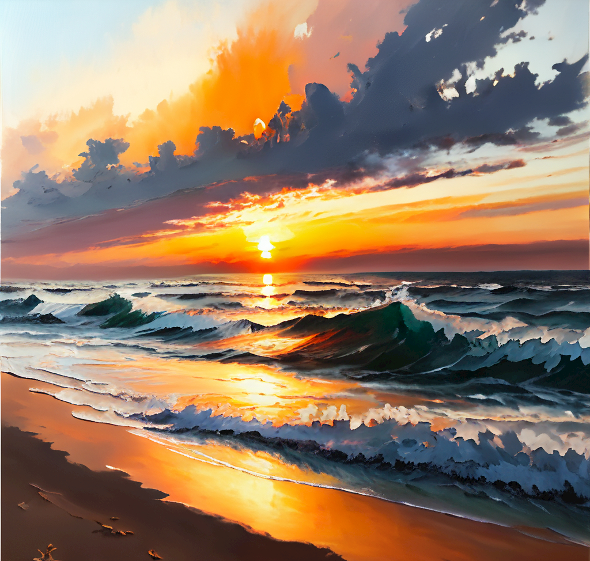
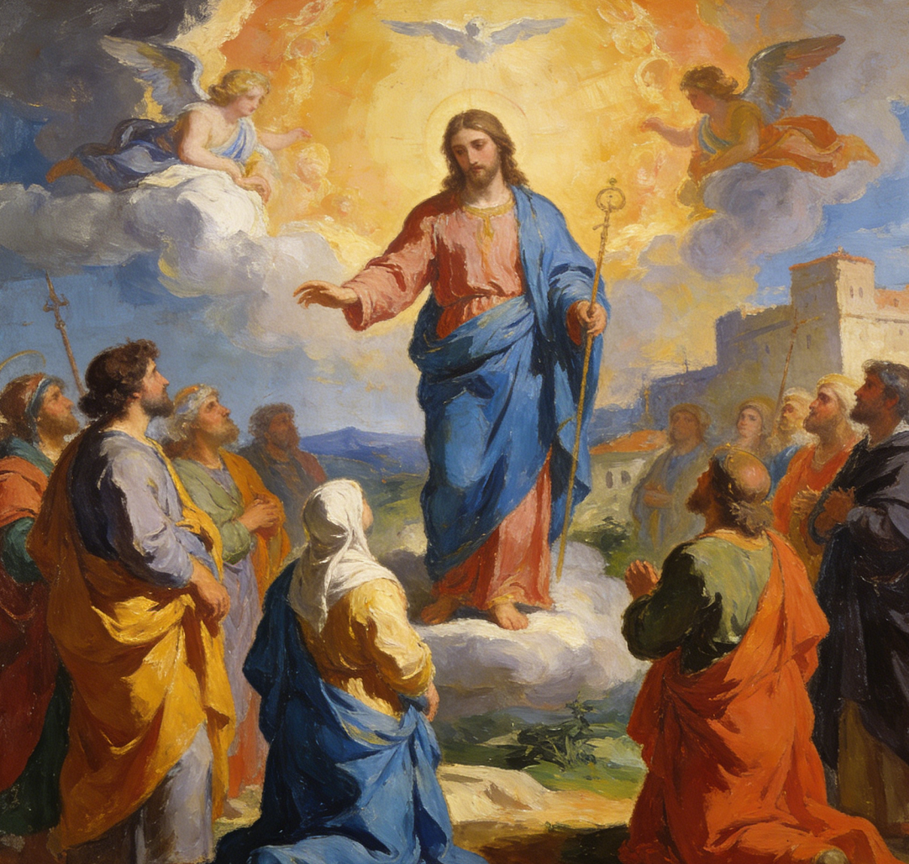
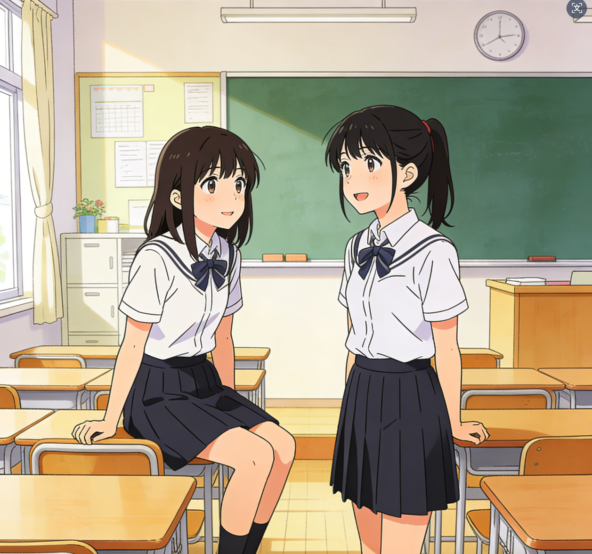
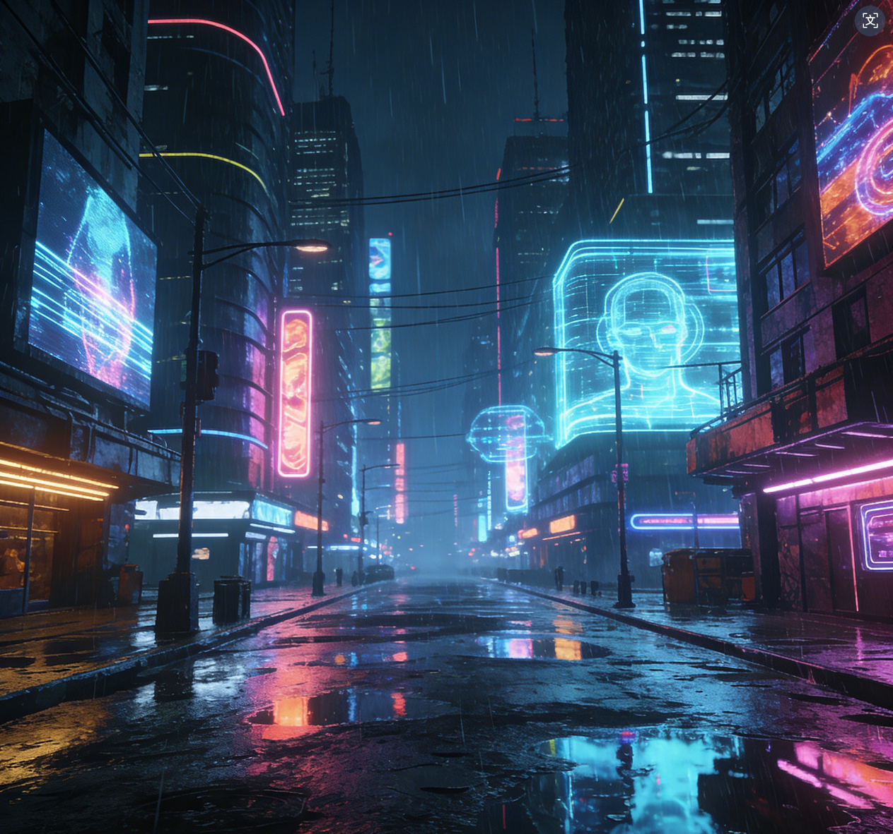
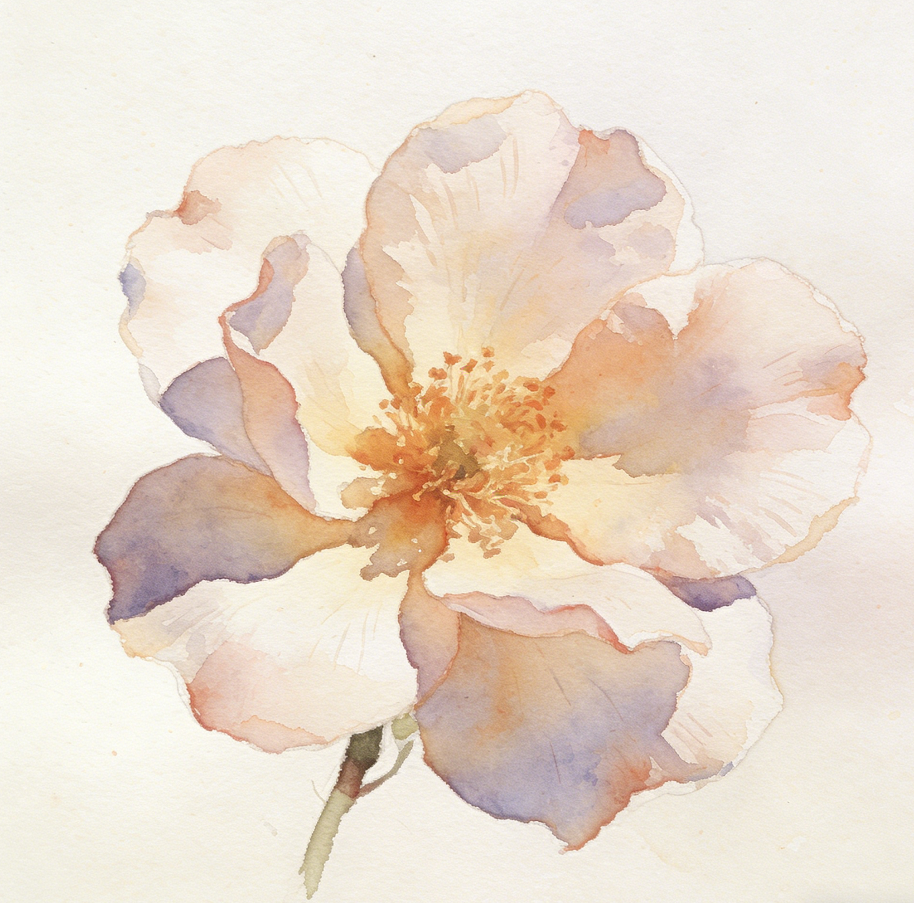

# 风格迁移工具 (Style Transfer Tool) v3.1

基于 PyTorch 和 VGG19 的神经网络风格迁移工具，支持多种预设艺术风格。

---

##  效果展示

### 预设风格滤镜预览

| 油画风格 | 梵高风格 | 漫画风格 |
|:---:|:---:|:---:|
|  |  |  |

| 赛博朋克 | 扁平插画 | 水彩风格 |
|:---:|:---:|:---:|
|  |  |  |

### 风格迁移效果示例

```
output/result_20260417_204007.jpg    (最新最强效果)
output/result_20260417_182137.jpg    (早期效果)
```

---

##  功能特点

- **多种预设风格**: 油画、水彩、赛博朋克、素描、卡通、扁平插画、中国风等
- **VGG19 特征提取**: 使用预训练 VGG 网络提取内容与风格特征
- **Gram矩阵风格损失**: 精确捕捉艺术风格的纹理和色彩分布
- **强力迁移模式**: 一键增强风格迁移效果
- **风格强度调节**: 0.5~3.0 精细控制风格程度
- **实时进度显示**: 训练过程可视化
- **多轮创作支持**: 连续创作，保留历史记录
- **Tkinter GUI**: 友好的图形界面

---

##  安装

```bash
# 安装依赖
pip install -r requirements.txt

# 如果有 NVIDIA GPU（推荐）
pip install torch torchvision --index-url https://download.pytorch.org/whl/cu118

# 如果没有 GPU
pip install torch torchvision --index-url https://download.pytorch.org/whl/cpu
```

---

##  使用方法

### 图形界面模式

```bash
python style_transfer_ui.py
```

**操作步骤：**

1. 点击 **"选择内容图片"** 选择待处理的原图
2. 选择以下任一方式选择风格：
   - 点击 **"选择风格图片"** 选择自定义风格图
   - 或从下拉菜单选择 **预设风格**
3. 调整参数：
   - **迭代次数**: 300-800（越多越精细，推荐 500）
   - **风格强度**: 0.5-3.0（越大风格越强）
   - **强力模式**: 勾选可获得极致风格效果
4. 点击 **"开始风格迁移"**
5. 等待完成，查看结果并保存

### 命令行模式

```bash
python style_transfer_final.py
```

默认参数：
- 内容图片: `content.jpg`
- 风格图片: `style.jpg`
- 输出目录: `output/`

---

##  预设风格说明

| 风格 | 路径 | 文件 | 特点 |
|------|------|------|------|
| 油画 | `jjfg/` | 微信图片_*.png | 厚重笔触，浓烈色彩 |
| 梵高风格 | `yhfg/` | y1.png, y2.png, y3.png | 旋转笔触，强烈表现力 |
| 漫画 | `mhfg/` | m1.png, m2.png | 线条清晰，色彩鲜艳 |
| 水彩 | `scfg/` | s1~s4.png | 柔和过渡，通透感 |
| 素描 | `smfg/` | s1.png, s2.png | 黑白灰调，艺术质感 |
| 赛博朋克 | `sbpk/` | cb1.png, sb2.png | 霓虹光效，未来科技感 |
| 扁平插画 | `cxfg/` | c1.png, c2.png | 简洁色块，平面设计感 |
| 艺术特效 | `yt/` | yt1.png, yt2.png | 综合滤镜，创意效果 |
| 印象派 | `yxfg/` | yx1.png, yx2.png | 模糊光影，色彩斑斓 |

---

##  参数调整指南

### 风格强度与效果对照

| 风格强度 | 效果描述 | 适用场景 |
|:---:|------|------|
| 0.5~1.0 | 轻微风格变化，保留原图结构 | 微妙调整 |
| 1.0~1.5 | 中等风格变化 | 日常创作 |
| 1.5~2.0 | 明显风格变化 | 艺术创作 |
| 2.0~3.0 + 强力模式 | 强烈风格，完全重绘 | 极致艺术效果 |

### 迭代次数建议

| 迭代次数 | 耗时 | 效果 |
|:---:|:---:|------|
| 100-200 | 快（~1分钟） | 草稿效果 |
| 300-500 | 中等（~3-5分钟） | 推荐日常使用 |
| 600-800 | 较慢（~8-10分钟） | 高质量输出 |
| 1000+ | 慢 | 极致精细 |

### 推荐配置

| 目标效果 | 迭代次数 | 风格强度 | 强力模式 |
|------|:---:|:---:|:---:|
| 轻微滤镜效果 | 300 | 0.5~1.0 | ❌ |
| 明显艺术风格 | 500 | 1.5~2.0 | ✅ |
| 彻底风格重绘 | 600-800 | 2.0~3.0 | ✅ |

---

##  项目结构

```
style_transfer/
├── style_transfer_main.py    # 主程序入口
├── style_transfer_ui.py       # Tkinter 图形界面 (推荐)
├── style_transfer_core.py     # 核心风格迁移算法
├── style_transfer_final.py   # 命令行版本
├── requirements.txt          # Python 依赖
├── README.md                  # 本文档
├── content.jpg               # 默认内容图片
├── style.jpg                 # 默认风格图片
├── output/                   # 输出目录
│   └── result_*.jpg          # 生成的结果图
├── jjfg/                     # 油画风格预设
│   └── 微信图片_20260417211304_2997_9.png
├── yhfg/                     # 梵高风格预设
│   ├── y1.png
│   ├── y2.png
│   └── y3.png
├── mhfg/                     # 漫画风格预设
├── scfg/                     # 水彩风格预设
├── smfg/                     # 素描风格预设
├── sbpk/                     # 赛博朋克风格预设
├── cxfg/                     # 扁平插画风格预设
├── yhfg/                     # 梵高油画风格预设
├── yt/                       # 艺术特效预设
└── yxfg/                     # 印象派风格预设
```

---

##  优化方向

### 1. 算法层面优化

| 优化方向 | 当前方案 | 优化建议 | 预期效果 |
|------|------|------|------|
| **模型升级** | VGG19 | 使用 AdaIN、WCT、USTYLE 等最新模型 | 速度更快、效果更自然 |
| **多尺度融合** | 单尺度 512px | 多种尺度特征融合 | 保留更多细节 |
| **风格保真度** | Gram 矩阵 | 加入风格正则化 | 色彩更准确 |
| **实时预览** | 训练后查看 | 每 N 轮生成预览图 | 及时调整 |

### 2. 用户体验优化

| 优化方向 | 实现方式 |
|------|------|
| **批量处理** | 支持文件夹批量转换 |
| **风格混合** | 同时应用多种风格 |
| **自定义预设** | 保存个人参数配置 |
| **历史记录** | 查看历次生成结果 |
| **移动端适配** | Web 界面或小程序 |

### 3. 性能优化

| 优化方向 | 实现方式 |
|------|------|
| **GPU 加速** | CUDA 优化（已有）|
| **模型量化** | INT8 量化推理 |
| **增量学习** | 缓存中间结果 |
| **批处理** | 一次处理多张图 |

### 4. 高级功能

| 功能 | 说明 |
|------|------|
| **局部风格迁移** | 只迁移图片的某一部分 |
| **视频风格迁移** | 对视频应用风格 |
| **3D 风格迁移** | 对 3D 模型/场景应用风格 |
| **可控风格强度** | 分别控制色彩、纹理、结构 |
| **AI 推荐风格** | 根据内容图推荐最合适风格 |

---

##  硬件要求

| 配置 | 要求 |
|------|------|
| **GPU** | NVIDIA GPU（推荐 4GB+ 显存）|
| **内存** | 最低 8GB，推荐 16GB |
| **存储** | 至少 5GB 可用空间 |

> **注意**: 没有 GPU 也能运行，但速度会明显变慢。

---

##  常见问题

### Q: 风格迁移效果不明显？
**A:** 尝试以下方法：
1. 调高"风格强度"滑块到 2.0 以上
2. 勾选"强力迁移模式"
3. 增加迭代次数到 600+
4. 更换风格更强烈的滤镜图

### Q: 程序运行很慢？
**A:** 
1. 确保已安装 CUDA 版本的 PyTorch
2. 降低迭代次数
3. 使用更小的图片尺寸

### Q: 预设风格图片无法加载？
**A:** 检查 `jjfg/`、`sbpk/` 等文件夹是否有图片文件，确保路径正确。

---

## License

MIT License
